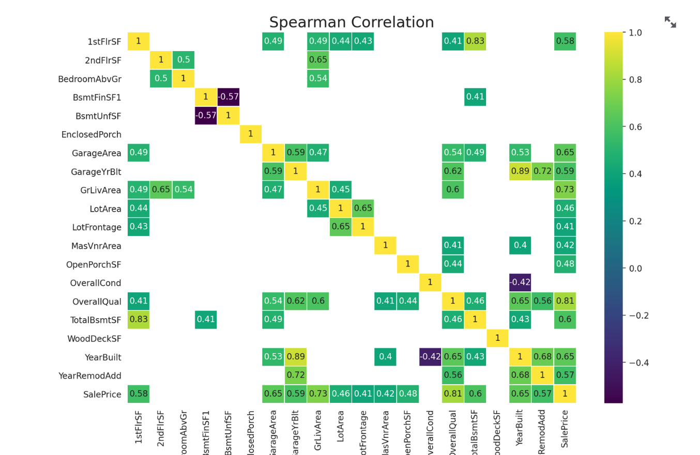

# Heritage Housing Issues

This is my final project for the Full Stack Software Development diploma. In this project, I've developed a data application which is presented on Streamlit. While I'm happy to reach this part of the course, this project was extremely challenging but was very rewarding to see what I could do when it came to analysis and manipulaton of a dataset. 

You can find the deployed site [here](https://heritage-housing-issues0000-27ab8e289bb3.herokuapp.com/).

# Dataset content

- The dataset is sourced from Kaggle. We then created a fictitious user story where predictive analytics can be applied in a real project in the workplace.

- The dataset has almost 1.5 thousand rows and represents housing records from Ames, Iowa, indicating house profile (Floor Area, Basement, Garage, Kitchen, Lot, Porch, Wood Deck, Year Built) and its respective sale price for houses built between 1872 and 2010.

| Variable      | Meaning                                                                | Units                                                                                                                                            |
| ------------- | ---------------------------------------------------------------------- | ------------------------------------------------------------------------------------------------------------------------------------------------ |
| 1stFlrSF      | First Floor square feet                                                | 334 - 4692                                                                                                                                       |
| 2ndFlrSF      | Second-floor square feet                                               | 0 - 2065                                                                                                                                         |
| BedroomAbvGr  | Bedrooms above grade (does NOT include basement bedrooms)              | 0 - 8                                                                                                                                            |
| BsmtExposure  | Refers to walkout or garden level walls                                | Gd: Good; Av: Average; Mn: Minimum; No: No Exposure; None: No Basement                                                                           |
| BsmtFinType1  | Rating of basement finished area                                       | GLQ: Good Living Quarters; ALQ: Average Living Quarters; BLQ: Below Average; Rec: Rec Room; LwQ: Low Quality; Unf: Unfinished; None: No Basement |
| BsmtFinSF1    | Type 1 finished square feet                                            | 0 - 5644                                                                                                                                         |
| BsmntUnfSF    | Unfinished square feet of basement area                                | 0 - 2336                                                                                                                                         |
| TotalBsmntSF  | Total square feet of basement area                                     | 0 - 6110                                                                                                                                         |
| GarageArea    | Size of garage in square feet                                          | 0 - 1418                                                                                                                                         |
| GarageFinish  | Interior finish of the garage                                          | Fin: Finished; RFn: Rough Finished; Unf: Unfinished; None: No Garage                                                                             |
| GarageYrBlt   | Year garage was built                                                  | 1900 - 2010                                                                                                                                      |
| GrLivArea     | Above grade (ground) living area square feet                           | 334 - 5642                                                                                                                                       |
| KitchenQual   | Kitchen quality                                                        | Ex: Excellent; Gd: Good; TA: Typical/Average; Fa: Fair; Po: Poor                                                                                 |
| LotArea       | Lot size in square feet                                                | 1300 - 215245                                                                                                                                    |
| LotFrontage   | Linear feet of street connected to property                            | 21 - 313                                                                                                                                         |
| MasVnrArea    | Masonry veneer area in square feet                                     | 0 - 1600                                                                                                                                         |
| EnclosedPorch | Enclosed porch area in square feet                                     | 0 - 286                                                                                                                                          |
| OpenPorchSF   | Open porch area in square feet                                         | 0 - 547                                                                                                                                          |
| OverallCond   | Rates the overall condition of the house                               | 10: Very Excellent; 9: Excellent; 8: Very Good; 7: Good; 6: Above Average; 5: Average; 4: Below Average; 3: Fair; 2: Poor; 1: Very Poor          |
| OverallQual   | Rates the overall material and finish of the house                     | 10: Very Excellent; 9: Excellent; 8: Very Good; 7: Good; 6: Above Average; 5: Average; 4: Below Average; 3: Fair; 2: Poor; 1: Very Poor          |
| WoodDeckSF    | Wood deck area in square feet                                          | 0 - 736                                                                                                                                          |
| YearBuilt     | Original construction date                                             | 1872 - 2010                                                                                                                                      |
| YearRemodAdd  | Remodel date (same as construction date if no remodeling or additions) | 1950 - 2010                                                                                                                                      |
| SalePrice     | Sale Price                                                             | 34900 - 755000                                                                                                                                   |

# Business Requirements (BR)

As a good friend, you are requested by your friend, who has received an inheritance from a deceased great-grandfather located in Ames, Iowa, to help in maximising the sales price for the inherited properties.

Although your friend has an excellent understanding of property prices in her own state and residential area, she fears that basing her estimates for property worth on her current knowledge might lead to inaccurate appraisals. What makes a house desirable and valuable where she comes from might not be the same in Ames, Iowa. She found a public dataset with house prices for Ames, Iowa, and will provide you with that.

1 - The client is interested in discovering how the house attributes correlate with the sale price. Therefore, the client expects data visualisations of the correlated variables against the sale price to show that.

2 - The client is interested in predicting the house sale price from her four inherited houses. 

# User Stories

## User Story 1 - Create Dashboard (BR1)

- As a User I want to be able to access an easy-to-use dashboard that showcases graphs and other relevant information. The dashboard is divided up into
5 different pages, Project Summary, Feature Correlation, Sale Price Predictor, Project Hypotheses and Validation and ML Sale Price Pipeline. You can find a detailed outline of the 5 pages below aswell as some screenshots. 

## User Story 2 - Dataset Access (BR1)

- As a Software Developer, I want to have access to a dataset which will allow me to create this project and carry out the necessary tasks to manipulate and
visualize data. The dataset was sourced from Kaggle. 

## User Story 3 - Data Cleaning (BR1)

- As a Software Devloper, I must clean the data in order handle missing values and remove errors and inconsistencies. This is so we have a clean dataset to work
off of for our project.

## User Story 4 - Automated Data Loading (BR1)

- As a Software Developer, I will use automated data loading I will import data files (CSV) into my Jupyter Notebooks. This is particularly useful when you need
to repeatedly load data or have various datasets. 

## User Story 5 - Data Visualization (BR1)

- As a User, I want to graphs and correlation represented in graphs, scatterplots etc. This would make it easier to understand and make it more visually appealling to the client. 

## User Story 6 - Cross Industry Standard Process for Data Mining (CRISP-DM) (BR1, BR2)

- As a Software Developer, I will use the CRISP-DM methodology as this will guide me through every stage of the project from business understanding to deployment. 

## User Story 7 - Validate Hypothesis

- As a User, I want to know the project hypotheses and how they were validated. 

## User Story 8 - Feature Engineering (BR1, BR2)

- As a Software Developer, I want to Feature Engineer the data as it turns raw data into a form that makes it easier for machine learning models to 
interpret patterns, relationships and trends. 

## User Story 9 - Business Requirements (BR1, BR2)

- As a Client, I want to ensure that the Business Requirements set out are met and that the features implemented to meet these Business Requirements work correctly. 

## User Story 10 - Deployment (BR1, BR2)

- As a Software Developer, I must deploy the site to Heroku and make sure it deploys without any errors. 

# Hypothesis and how to validate

In Machine Learning, a hypothesis refers to a model or function that you assume can predict the output from the given input data. It represents your best guess about how the input features relate to the target variable. 

 - Hypothesis 1 - Houses with 4 bedrooms appear to reach the highest prices, with one exceeding $700,000. 

 - Hypothesis 2 - Homes with smaller unfinished basements tend to have a wider range of sale prices. Sale prices are influenced by several factors and unfinished areas would be a major issue. 

 - Hypothesis 3 - Houses with larger amounts of square footage on the first floor generally cost more than houses with smaller amounts of square footage. 

# Rationale to map the business requirements to the data visualizations and Machine Learning tasks

## Business Requirement 1: Data Visualization and Correlation Study

- We will load, inspect, clean, feature engineer and evaluate the data related to the houses in question. 

- We will conduct a correlation study to better understand how each variable correlates and impacts on the Sale Price of a house. 

- We will use the visual representations of the data (graphs) to validate hypotheses and also anwser our business requirements. 

- For more information, please visit the "Sale Price Study" workbook.

## Business Requirement 2: Regression Pipeline

- We want to be able to predict the sale price of the 4 inherited houses for our client. 

- We built a regression model to help predict the sale price. We also trained this model. 

- We also want to find out R2 score and Mean Absolute Error. (See screenshots).

# Machine Learning Business Case

- We need to implement an ML model to predict the sale price of a house. For this particular project, we went with a Regression Model. A Regression Model can be defined as a model which describes the relationship between one or more independent variables and a target variable. The target variable in this case is the SalePrice. 

- We want to provide the client with an app that with will predict the sale price of 4 inherited houses for her. Which will give her a better chance to secure maxium profit. 

- The model success metrics are as follows: **At least 0.75 R2 score on train and test set** and the model would be considered **a failure if after 12 months has elapsed, that the model would stop predicting the sale price accurately**. 

- As mentioned above, the target variable is **sale price**. 

# Dashboard Design

- The dashboard contains a very simple layout. It contains 5 pages, **Project Summary, Feature Correlation, Sale Price Predictor, Project Hypothesis and Validation and ML Sale Price Pipeline**. 

- **Page 1 - Project Summary:** This page shows a where the data is sourced from, a link to the READme and the Business Requirements. 

- **Page 2 - Feature Correlation:** This page shows feature correlation and key observations. Please click the checkboxes to see the graphs.

- **Page 3 - Sale Price Predictor:** This is the page where you can run your predictive analysis and predict the price of the 4 inherited houses.

 

- **Page 4 - Project Hypothesis and Validation:** You can view my project hypothesis' and validation here. 

- **Page 5 - ML Sale Price Pipeline:** You can view the pipeline, feature importance and R2 score here. 

- See below for textual interpration of the graphs on the dashboard: 

 

- This graph shows the the distribution of Sale Price, with sale price on the x-axis and number of houses on the y-axis.

- This set of graphs shows how the target variable (sale price) correlates with all the other variables. 

- This set of graphs shows Pearson, Spearman and Predictive Power Score (PPS) and depicts how the variables collaborate with eachother. 

# Unfixed Bugs 

- I never got my widgets working properly. But when you **"Run Predictive Analysis"** you still get predicted prices of the 4 inherited houses. 

- Please see the above terminal warning when I press the checkboxes to display my graphs on the Feature Correlation page. All graphs display perfectly. 

# Deployment

## The deployment process is done through Heroku. This site is used for this project as it is better for hosting backend files. Please follow the below steps to deploy this project:

- Create a Heroku accout if you haven't done so already. 

- Create a new app, give it a unique name and select your region from the options provided.

- Connect to GitHub (you might be asked to confirm login through the mobile app if you have it downloaded).

- Select the appropriate branch from which you want to deploy the project from. 

- Deploy the project. Keep an eye on the build log if the deployment fails, this will suggest any changes that need to be made in order to deploy successfully.

# Main data analysis and Machine Learning libraries

- **Streamlit:** This is what we used to create the dashboard. Building apps using Streamlit is effortless. It's particularly useful for data applications and machine learning models. It's also handy for people with minimal front-end experience. 

- **NumPy:** This is what we used to process arrays and the store the values. This is a powerful library for numerical computing in Python. 

- **Pandas:** We used this for data manipulation and analysis. It provides two main structures, Series and DataFrames. DataFrames are something we used a lot in this project. 

- **Matplotlib:** This was used for generating graphs for data visualization. 

- **Scikit-learn:** This was used for pipeline creation and the application of algorithms throughout my project. It also provides tools for predictive modelling and model evaluation. 

- **Seaborn:** This was particularly useful for the visualization of data on Streamlit. It implements attractive and styled visuals. 

- **Git:** This was used for version control. You can write a commit message using the following commands: -> **"git add ." -> "git commit -m message" -> "git push". It's good practice to keep commit messages under 50 characters. 

- **Feature-engine:** This library is essential for the Feature Engineering notebook. It also offers transformer classes. 

- **Kaggle:** This is where the dataset we used for Heritage Housing Issues was used. The link can be found above and was granted to us by Code Institute. 

- **Python:** The main programming language used for this project. 

# Credits / References

- My mentor Mo Shami, for his patience and guidance through the development of this project. 

- My brother Sean, for his help and input. 

- The Churnometer walkthrough was very helpful with this project. 

- The template for the project is provided by Code Institute. 

- The Code Institute LMS contained all the lessons which helped me become familiar with the concepts around this project. 

- The dataset was accessed on Kaggle through Code Institute. 

- Roman and John of Code Institute who were very helpful and patient with my queries on the Slack channel.
